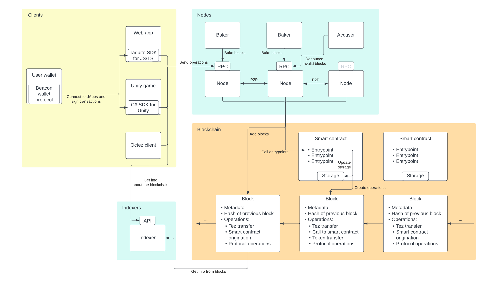
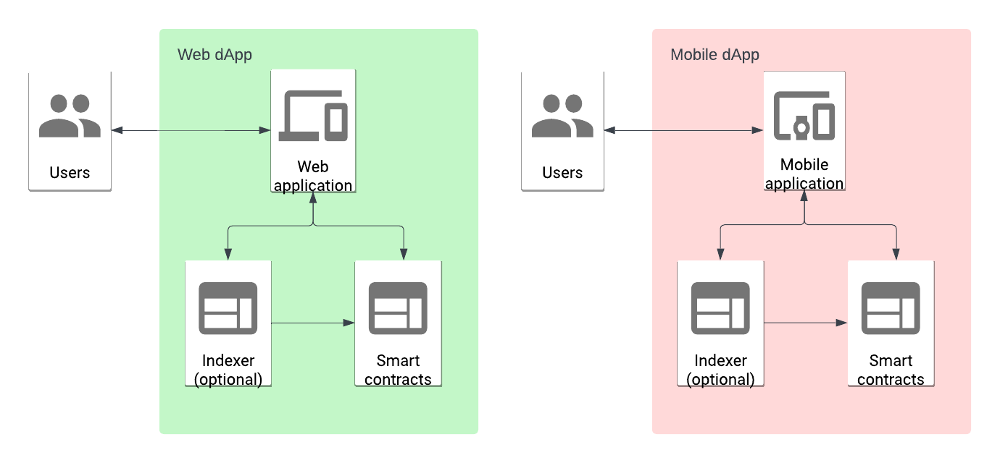

# Jump-start for Tezos hackathons

Here's some information to help new developers get started hacking with Tezos.
This is not a comprehensive reference for all of Tezos; it's just an overview.
For links to complete reference information, see [References](#references).

## Table of contents

- [What is Tezos?](#what-is-tezos)
- [What can I do with Tezos?](#what-can-i-do-with-tezos)
- [Tutorials](#tutorials)
- [Diagram](#diagram)
- [What are tokens and NFTs?](#what-are-tokens-and-nfts)
- [Decentralized applications (dApps)](#decentralized-applications-dapps)
- [How do I access Tezos?](#how-do-i-access-tezos)
  - [The Octez client](#the-octez-client)
  - [The Taquito SDK for JavaScript and TypeScript](#the-taquito-sdk-for-javascript-and-typescript)
  - [The Tezos SDK for Unity](#the-tezos-sdk-for-unity)
- [Using test networks and faucets](#using-test-networks-and-faucets)
- [Funding a wallet](#funding-a-wallet)
- [Writing smart contracts](#writing-smart-contracts)
- [Creating tokens](#creating-tokens)
- [Getting information about Tezos](#getting-information-about-tezos)
- [Getting help](#getting-help)
- [References](#references)
- [Tools](#tools)

## What is Tezos?

Tezos is an open-source, decentralized blockchain created in 2014 by Arthur and Kathleen Breitman.
It is a decentralized computer system that users can use to store and exchange cryptocurrencies and other tokens and to host decentralized applications.

## What can I do with Tezos?

You can do lots of things with Tezos, but here are some ideas:

- **Manage tokens**: Tezos manages digital assets called _tokens_.
Tokens can represent anything that you want them to represent and behave in any way that you program them to behave.
You can use tokens as game pieces, to represent ownership over real-world items, as indicators of membership in an organization, or to represent quantities of things.

- **Run programs**: Tezos is a platform for deploying programs called _smart contracts_, which behave like APIs.
You can deploy smart contracts to Tezos and not worry about where they are running, and users can call them from many different clients.
These smart contracts can behave as the backend to applications, as APIs, or as a source of immutable, trusted logic.

- **Accept payments**: Using Tezos to manage online payments is much easier than accepting credit cards because Tezos and wallet applications handle all of the security for you.

- **Run games**: The Tezos SDK for Unity lets you use Tezos as a backend for games, keeping track of players' inventories and allowing them to work with their items in and out of your games.
You can also use Tezos to handle logic and security for games, such as encrypting player choices until it's time to reveal them.
For an example, see the tutorial [Create a mobile game](https://docs.tezos.com/tutorials/mobile) and the [Unity SDK](#the-tezos-sdk-for-unity).

- **Create organizations**: You can set up digital autonomous organizations (DAOs) to manage online groups, allow voting on issues and proposals, and share and distribute resources.

## Tutorials

You can get started with Tezos by going through the tutorials at https://docs.tezos.com/tutorials.

## Diagram

The following diagram shows the major components of Tezos:

- **Nodes**: The backbone of Tezos is a network of computers that run the Tezos protocol.
Anyone can run a node and no one is directly in charge of the nodes, which makes the system resilient and decentralized.

  The nodes run the Tezos protocol that any user can call or deploy programs called smart contracts to, which makes the system behave like a globally-distributed operating system.
  Nodes have an [RPC interface](https://docs.tezos.com/architecture/rpc) that allows clients to call them, though not all nodes make their RPC interface public.

  The nodes work closely with **bakers** and **accusers**, which package the transactions that users and other clients send into blocks to go on the blockchain.

- **Blockchain**: The blockchain itself is a record of transactions and other operations that happen on Tezos.
Aside from metadata, each block contains transactions from users and other clients.
The main types of transactions that hackathon users are interested in are:

  - Transferring of tez from one account to another
  - Creating other kinds of tokens
  - Transferring of other kinds of tokens from one account to another
  - Deploying smart contracts
  - Calling smart contracts

  The diagram shows **smart contracts** as part of the blockchain because their code and storage is stored in the blocks.

- **Indexers**: Indexers are applications that retrieve blockchain data, process it, and store it in a way that makes it easier to search and use.

- **Clients**: Many different clients can access Tezos for information, to initiate token transfers, and to call smart contracts.



## What are tokens and NFTs?

The main cryptocurrency of Tezos is a type of token called _tez_, which is sometimes referred to as ꜩ or as XTZ.
Tezos users use tez to pay transaction fees and as a method of payment and exchange.

Tezos also lets you create your own tokens, including:

- Fungible tokens, which are interchangeable and accounts can own any amount of, like tez
- Non-fungible tokens (NFTs), which are unique digital assets that can represent ownership of something specific
- Stablecoins, which are tied to the price of fiat currencies such as USD and EUR
- Wrapped tokens, which represent tokens from another blockchain or another standard

For more information and tutorials, see [Tokens](https://docs.tezos.com/architecture/tokens).

## Decentralized applications (dApps)

Applications that use Tezos are called decentralized applications (dApps) because they run not on only one computer, but on the network of Tezos nodes all around the world.
This makes them resilient, so you don't have to worry about when, where, or whether your programs will run.

dApps usually have two parts:

- **Frontend**: An ordinary web, desktop, or mobile app; this is referred to as the _off-chain_ part because it runs on ordinary web or application hosting, not on Tezos itself
- **Backend**: One or more smart contracts; they are referred to as the _on-chain_ part because they run on Tezos itself

dApps can also have middleware in the form of an [indexer](https://docs.tezos.com/developing/information/indexers) to interpret the backend information and provide it in a more convenient format for the frontend component.

For examples of dApp front ends, see the applications in the https://github.com/trilitech/tutorial-applications repository.

Here's a diagram of how these parts work together:



## How do I access Tezos?

The most popular ways to access Tezos are:

- [The Octez command-line client](#the-octez-client)
- [The Taquito SDK for JavaScript and TypeScript](#the-taquito-sdk-for-javascript-and-typescript)
- [The Tezos SDK for Unity](#the-tezos-sdk-for-unity)
- [Block explorers](#getting-information-about-tezos)

### The Octez client

The Octez client is a command-line client for Tezos.
You can use it either through installing it locally or by using the [tezos/tezos](https://hub.docker.com/r/tezos/tezos) Docker image.
To install it locally, see [Installing the Octez client](https://docs.tezos.com/developing/octez-client/installing).
For setup and configuration information, see [Setting up the client](https://tezos.gitlab.io/user/setup-client.html) in the Octez documentation.

Here are some common commands for the octez-client:

- `octez-client man [search term]`: Search for a command
- `octez-client gen keys my_account`: Create an account with the alias "my_account" in the client's local wallet
- `octez-client get balance for my_account`: Get the tez balance of the account with the alias "my_account"
- `octez-client show address my_account`: Print the address for the alias "my_account"
- `octez-client list known addresses`: Print information about the accounts in the client's local wallet
- `octez-client --wait none transfer 1 from my_account to other_account --burn-cap 0.1`: Transfer 1 tez from "my_account" to "other_account" and accept a fee as high as 0.1 tez

Deploying a smart contract is called "origination" and it requires the source code of the contract in Michelson and the initial value of the contract storage.
For example, this code originates a contract from the source code file `my_new_contract_source.tz` and initializes its storage to "hello":

```bash
octez-client originate contract my_new_contract \
  transferring 0 from my_account \
  running my_new_contract_source.tz \
  --init 'hello' --burn-cap 0.5 --force
```

The `my_new_contract` in the first line is the local alias for the contract, so you can call it using that alias instead of the full address.
For example, if the contract has an entrypoint named "doSomething" that accepts an integer, you can call it with a command that looks like this:

```bash
octez-client --wait none transfer 0 from my_account \
  to my_new_contract --entrypoint "doSomething" \
  --arg '122' --burn-cap 0.1
```

### The Taquito SDK for JavaScript and TypeScript

The Taquito SDK for JavaScript and TypeScript lets you connect to user wallets and send transactions to Tezos.

For an introduction to Taquito, see https://docs.tezos.com/dApps/taquito.

For complete Taquito documentation, see https://tezostaquito.io.

For tutorials that use Taquito, see:

- https://docs.tezos.com/tutorials/build-your-first-app
- https://docs.tezos.com/tutorials/create-an-nft/nft-web-app

For starter Taquito applications, see https://github.com/trilitech/tutorial-applications.

### The Tezos SDK for Unity

You can install the SDK for the Unity game development platform to call Tezos from Unity games, including locally-installed games, mobile apps on Android and iOS, and WebGL-based games on web pages.
The SDK allows you to work with Tezos via C# code that backs objects in the Unity editor.

The SDK has a quickstart here: https://docs.tezos.com/unity/quickstart

## Using test networks and faucets

To avoid working with real cryptocurrency on Tezos Mainnet, you can use the test network named Ghostnet.
Its faucet provides free tez tokens so you can deploy contracts and work with them at no cost.

For information about Ghostnet, see https://teztnets.com/ghostnet-about.

The Ghostnet faucet is at https://faucet.ghostnet.teztnets.com.
You put in your account address and the faucet sends you tez tokens.

To use test networks, you have to point your client or SDK to an RPC endpoint for that network instead of for Tezos Mainnet.
RPC nodes are like API servers that you can send Tezos transactions to and retrieve information about Tezos from.
The [Ghostnet page](https://teztnets.com/ghostnet-about) has a list of public RPC endpoints that you can use.

- The online IDEs for LIGO and SmartPy have settings for Ghostnet.
- To set the Octez client to use Ghostnet, pass the RPC endpoint that you want to use, as in this example: `octez-client -E https://rpc.ghostnet.teztnets.com config init`
- To set Taquito to use Ghostnet, create an instance of Taquito with the RPC endpoint, as in this example:

   ```javascript
   import { TezosToolkit } from "@taquito/taquito";
   const rpcUrl = "https://ghostnet.ecadinfra.com";
   const Tezos = new TezosToolkit(rpcUrl);
   ```
- The Unity SDK uses Ghostnet by default.

## Funding a wallet

To interact with most dApps, you need a wallet, which stores your private key and allows you to approve Tezos transactions from dApps.
Wallets are available as browser plugins, mobile apps, and social apps.
For information about getting a wallet, switching it to Ghostnet, and funding it from the faucet, see https://docs.tezos.com/developing/wallet-setup.

## Writing smart contracts

Tezos smart contracts are pieces of code stored on the blockchain.
After they are deployed, they are immutable and cannot be shut down or prevented from running.

A smart contract is composed of three elements:

- Its balance: a contract is a kind of account, and can receive and send tez
- Its [storage](https://docs.tezos.com/smart-contracts/storage): data that is dedicated to and can be read and written by the contract
- Its code: one or more [entrypoints](https://docs.tezos.com/smart-contracts/entrypoints), which are a kind of function that can be called either from outside the chain or from other contracts

You can think of a smart contract as a single independent application with its own storage and an API that consumers can call.
However, smart contracts have some limitations.

All a contract can do can be summarized as:

- Performing computations
- Reading or updating the value of its own storage
- Generating a list of operations, such as calls to other contracts (see [Operations](https://docs.tezos.com/smart-contracts/logic/operations))

Smart contracts can't do these things:

- Access programs outside the blockchain, including calling external APIs
- Access other contracts' storage
- Change their code, except in specific cases (see [Lambdas](https://docs.tezos.com/smart-contracts/data-types/complex-data-types#lambdas))
- Catch and respond to errors (see [Handling errors](https://docs.tezos.com/smart-contracts/logic/errors))

For examples of smart contracts, see https://docs.tezos.com/smart-contracts/samples

### Smart contract languages

You can write Tezos smart contracts in these languages:

- SmartPy, which has a syntax similar to Python
- LIGO, which has versions with syntaxes similar to JavaScript/TypeScript and OCaml

Each of these languages are eventually compiled to Michelson, the base language for Tezos smart contracts.
Michelson is a stack-based language and is hard to read, so most people use one of the high-level languages instead.

For a tutorial that covers writing a basic smart contract in each of these languages, see https://docs.tezos.com/tutorials/smart-contract.

#### SmartPy

[SmartPy](https://smartpy.io/) is a version of Python that you can use to write smart contracts.
You can use it to write, test, and deploy smart contracts in two basic ways:

- You can use the online IDE at https://smartpy.io/ide
- You can write contracts in your own IDE and then use Python on the command line to test and compile them; see https://smartpy.io/manual/introduction/installation

Here's a simple smart contract in SmartPy.
It stores a string and allows callers to change that string.
It provides an entrypoint named `replace` that replaces the string with the string that the caller sends, and an entrypoint named `append` that adds the string to the string that the caller sends.
Indentation is significant in Python, so be careful to keep it the same if you copy this code:

```python
import smartpy as sp

@sp.module
def main():
    class StoreGreeting(sp.Contract):
        def __init__(self, greeting):
            # Initialize the storage with a string passed at deployment time
            # Cast the greeting parameter to a string
            sp.cast(greeting, sp.string)
            self.data.greeting = greeting

        @sp.entrypoint # Entrypoint to replace the string
        def replace(self, params):
            self.data.greeting = params.text

        @sp.entrypoint
        def append(self, params): # Entrypoint to append to the string
            self.data.greeting += params.text

# Automated tests that run on simulation
@sp.add_test()
def test():
    # Initialize the test scenario
    scenario = sp.test_scenario("Test scenario", main)
    scenario.h1("StoreGreeting")

    # Initialize the contract and pass the starting value
    contract = main.StoreGreeting("Hello")
    scenario += contract

    # Verify that the value in storage was set correctly
    scenario.verify(contract.data.greeting == "Hello")

    # Test the entrypoints and check the new storage value
    contract.replace(text = "Hi")
    contract.append(text = ", there!")
    scenario.verify(contract.data.greeting == "Hi, there!")
```

Try pasting this code into the online IDE at https://smartpy.io/ide and deploying it yourself.
For a walkthrough, see see https://docs.tezos.com/tutorials/smart-contract.

If you prefer to work directly on your own computer, you can install Python and SmartPy locally and use these commands to test, compile, and deploy the smart contract:

```bash
python store_greeting.py

cd Test_scenario/

octez-client originate contract storeGreeting \
  transferring 0 from my_account \
  running step_002_cont_0_contract.tz \
  --init '"Hello"' --burn-cap 0.1
```

Now you can call the contract by running this command:

```bash
octez-client --wait none transfer 0 from my_account \
  to storeGreeting --entrypoint 'replace' \
  --arg '"Hi there!"' --burn-cap 0.1
```

You can also get the address for the contract, which starts with `KT1`, and look it up in a [Block explorer](#getting-information-about-tezos) to see its transactions, tokens, and storage.

#### LIGO

[LIGO](https://ligolang.org/) is a language that you can use to write smart contracts.
It has a version called CameLIGO that works like OCaml and a version called JsLIGO that works like TypeScript.
You can use it to write, test, and deploy smart contracts in two basic ways:

- You can use the online IDE at https://ide.ligolang.org/
- You can write contracts in your own IDE and then use the LIGO command-line tool to test and compile them; see https://ligolang.org/docs/intro/installation?lang=jsligo

JsLIGO cheat sheet: https://gl.githack.com/ligo.suzanne.soy/training-gitpod/raw/master/cheat-sheet-jsligo.html

Here's a simple smart contract in JsLIGO.
It stores a number and allows callers to change it.
It provides three entrypoints:

- The `increment` endpoint accepts an integer as a parameter and adds that integer to the value in storage
- The `decrement` endpoint accepts an integer as a parameter and subtracts that integer to the value in storage
- The `reset` endpoint takes no parameters and resets the value in storage to 0

Each entrypoint returns a list of other Tezos transactions to run (in these cases, an empty list) and the updated value of the contract's storage.

```ts
namespace Counter {
  type storage = int;
  type returnValue = [list<operation>, storage];

  // Increment entrypoint
  // Accept an int and the current value of the storage as a parameter
  // Return a list of operations to run next and the new value of the storage
  @entry
  const increment = (delta : int, store : storage) : returnValue =>
    [list([]), store + delta];

  // Decrement entrypoint
  // Accept an int and the current value of the storage as a parameter
  // Return a list of operations to run next and the new value of the storage
  @entry
  const decrement = (delta : int, store : storage) : returnValue =>
    [list([]), store - delta];

  // Reset entrypoint
  // Accept "unit" to indicate no parameter and the current value of the storage
  // Return a list of operations to run next and the new value of the storage
  // Add underscores to parameter names to avoid errors about unused variables
  @entry
  const reset = (_p : unit, _s : storage) : returnValue =>
    [list([]), 0];
}
```

Try pasting this code into the online IDE at https://ide.ligolang.org/ and deploying it yourself.
For a walkthrough, see see https://docs.tezos.com/tutorials/smart-contract.

If you prefer to work directly on your own computer, you can install LIGO and use these commands to test, compile, and deploy the smart contract:

```bash
ligo run dry-run counter.jsligo -m Counter "Increment(32)" "10"

ligo compile contract counter.jsligo -m Counter -o increment.tz

octez-client originate contract counter \
    transferring 0 from my_account \
    running counter.tz \
    --init 10 --burn-cap 0.1 --force
```

Now you can call the contract by running this command:

```bash
octez-client --wait none transfer 0 from my_account \
  to counter --entrypoint 'increment' \
  --arg '5' --burn-cap 0.1
```

You can also get the address for the contract, which starts with `KT1`, and look it up in a [Block explorer](#getting-information-about-tezos) to see its transactions, tokens, and storage.

## Creating tokens

Tokens are managed by smart contracts, so the first step to creating tokens is to create a smart contract.
For example, SmartPy has a toolkit called [FA2 lib](https://smartpy.io/guides/FA2-lib/overview) that provides a standard contract for working with tokens.

There are also several tutorials that deal with NFTs and other kinds of tokens at https://docs.tezos.com/tutorials.

## Getting information about Tezos

- **Block explorers** are applications that provide info about Tezos and allow users to do basic interaction with Tezos, like calling smart contracts.
[Better Call Dev](https://better-call.dev) and [TzKT](https://tzkt.io/) are popular Tezos block explorers.
For example, this link shows information about the deployed contract from the tutorial [Build a simple web application](https://docs.tezos.com/tutorials/build-your-first-app): https://better-call.dev/ghostnet/KT1R2LTg3mQoLvHtUjo2xSi7RMBUJ1sJkDiD/operations.

- **Indexers** are applications that retrieve blockchain data, process it, and store it in a way that makes it easier to search and use.
For example, you can use indexers to get a list of all of the accounts that have called a certain smart contract, or a list of accounts that own a certain token.

  Tezos has public indexers, but you can also set up your own indexer if you want specific information.
  See [Indexers](https://docs.tezos.com/developing/information/indexers).

  For example, this TzKT query gets an account's balance of the USDT token by passing the address of the account and the address of the contract that manages the token:

  ```
  https://api.tzkt.io/v1/tokens/balances?token.contract=KT1XnTn74bUtxHfDtBmm2bGZAQfhPbvKWR8o&account=tz1a1RTsGUbads3VucUQDxJF4EDXkDWcDHPK
  ```

   For information about the TZKT indexer's API, see https://api.tzkt.io.

- **RPCs** are interfaces that nodes provide to share technical information, such as the content of blocks.
This information is used more by computers than humans.
For reference information about RPC endpoints, see https://tezos.gitlab.io/shell/rpc.html.

  For example, to get the contents of block number 2, run `octez-client rpc get /chains/main/blocks/2` or `curl -X GET "https://rpc.ghostnet.teztnets.com/chains/main/blocks/2"`.

## Getting help

- For general developer help, use the Tezos Discord: https://discord.gg/tezos
- For LIGO, use the #ligo channel in the Tezos Discord or the LIGO Telegram: https://t.me/LigoLang
- For SmartPy, use the #smartpy channel in the Tezos Discord or the SmartPy Telegram: https://t.me/SmartPy_io
- For Taquito, use the Tezos Discord or ask the chatbot on https://tezostaquito.io/docs/quick_start

For more community resources, see https://tezos.com/community.

## References

- Developer information: https://docs.tezos.com
- Developer learning series: https://opentezos.com/
- Applications from Tezos tutorials: https://github.com/trilitech/tutorial-applications
- Documentation for the Octez suite, mostly about managing nodes and bakers: https://tezos.gitlab.io/

- LIGO docs: https://ligolang.org/docs/intro/introduction
- SmartPy docs: https://smartpy.io/manual/introduction/overview

- Sample smart contracts: https://docs.tezos.com/smart-contracts/samples

## Tools

Here are some other tools for working with Tezos:

### dApp SDKs

- Taquito SDK for sending transactions to Tezos in JavaScript and Typescript: https://tezostaquito.io
- Beacon SDK for connecting to Tezos wallets: https://docs.walletbeacon.io/
- Tezos SDK for the [Unity](https://unity.com/) game platform: https://docs.tezos.com/unity

### Development tools

- Taqueria development platform for Tezos: https://taqueria.io/
- Indexers and block explorers:
  - [TzKT](https://api.tzkt.io/)
  - [Better Call Dev](https://better-call.dev)
- Flextesa sandbox tool: https://tezos.gitlab.io/flextesa/ with more information at https://tezos.gitlab.io/user/sandbox.html
- Smart contract visualization tool: [VisualTez](https://visualtez.com/editor)
- Decentralized file storage: https://pinata.cloud/

### VSCode plugins

- [ligo-vscode](https://marketplace.visualstudio.com/items?itemName=ligolang-publish.ligo-vscode)
- [LIGO debugger](https://marketplace.visualstudio.com/items?itemName=ligolang-publish.ligo-debugger-vscode)
- [Taqueria](https://marketplace.visualstudio.com/items?itemName=PinnacleLabs.taqueria)
